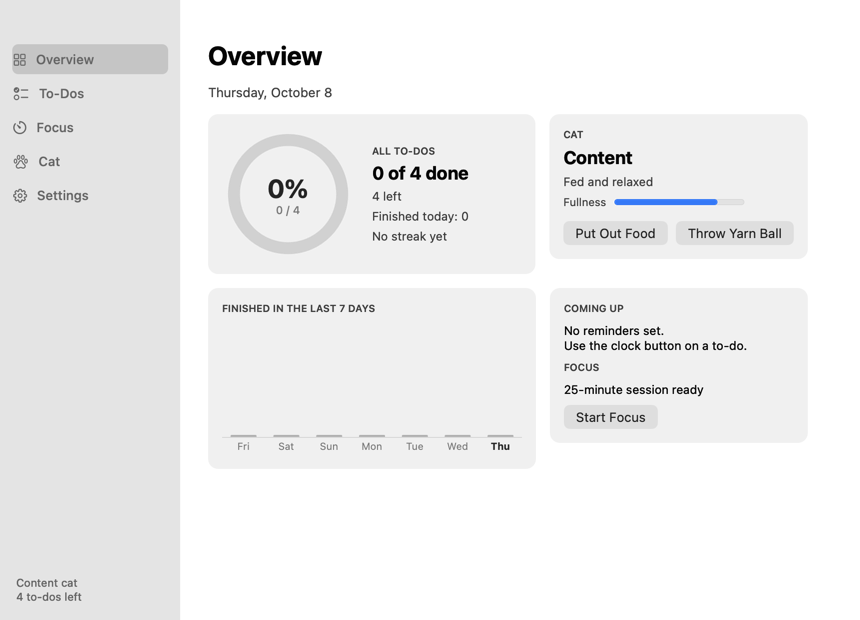

# Do It Meow

A pixel cat that lives on your Mac desktop and keeps your to-dos.


- Click the cat for a speech bubble with your to-dos and memos.
- It wanders, climbs onto windows and peeks over them, naps in a nightcap, eats, and chases a yarn ball.
- The app window has an overview with a completion ring, to-dos with reminders, notes, timers, a calendar, a focus timer, and settings.



## Install

Requires macOS 13 or later and the Xcode command line tools.

```bash
make install
```

This builds the app, copies it to `/Applications`, and opens it. To install somewhere else, run `./Installer/install.sh ~/Applications`. `make uninstall` removes it.

## Develop

```bash
make run     # build into build/ and launch
make clean   # delete build/
```

## Layout

| Path | What it holds |
|---|---|
| `Sources/PixelCat/main.swift` | The cat, its sprites and behaviour, the speech bubble |
| `Sources/PixelCat/Hub.swift` | The app window, menu bar, status item, quick add |
| `Sources/PixelCat/Notes.swift` | Notes |
| `Sources/PixelCat/Timers.swift` | Countdown timers |
| `Sources/PixelCat/Calendar.swift` | Month calendar of to-do reminders |
| `Resources/Info.plist` | App bundle metadata |
| `Scripts/build.sh` | Builds `build/PixelCat.app` with its icon |
| `Installer/` | Install and uninstall scripts |
| `docs/screenshots/` | Pictures used in this README |
